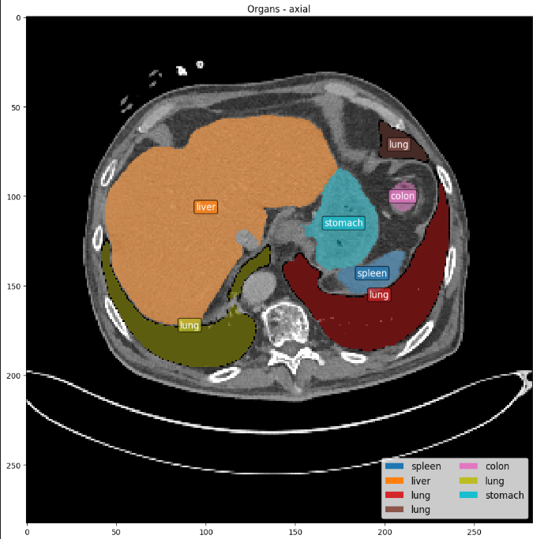
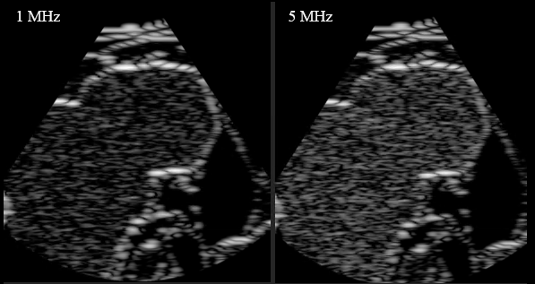
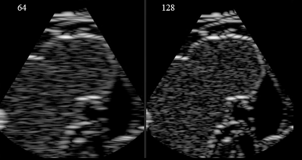

#  Simple synthesis of ultrasound B-mode image by convolution

##  Overview
This project implements a simplified simulation of ultrasound (US) imaging based on CT data and corresponding tissue segmentations.  
The pipeline models biological tissues as distributions of scatterers and generates B-mode ultrasound images.

## Dataset

The project uses a 3D CT volume with corresponding segmentation masks.

**Important:**  
The dataset is too large to be included in this repository.

It can be downloaded from: https://zenodo.org/records/10047263

After downloading make "data" folder and input dataset there.

## Methodology
The B-mode ultrasound image is generated from axial cross-sectional slices of the CT volume, which are used as the basis for acoustic impedance modeling and subsequent ultrasound simulation.
The following figure shows an axial CT slice with overlaid anatomical structures and segmented organs.

  

The synthesis of the ultrasound B-mode image consists of three main steps:

### 1. Acoustic Impedance Map
Each tissue type is assigned a specific acoustic impedance value.  
Using segmentation masks, a spatial map is created that represents the physical properties of the medium.

### 2. PSF with convolution
The radiofrequency (RF) image is generated by convolving the acoustic impedance map with a modeled PSF, simulating the response of an ultrasound system.

### 3. B-mode Image Formation
The final ultrasound image is obtained by applying:
    Hilbert transform (envelope detection)
    Logarithmic compression (dynamic range adjustment)

---

## Results

The following images show the influence of different pulse frequencies on the generated B-mode ultrasound image

  

The following images compare the effect of different numbers of probe elements on image resolutions quality.

  

## Author

Marta Dasović
